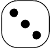

Let's Roll Some Dice!
=====================

Contents
========

* [Overview](#overview)
* [Let's Play!](#lets-play)
* [Rules of the Game](#rules-of-the-game)
	* [Come Out Roll](#come-out-roll)
	* [Second Roll and Forward](#second-roll-and-forward)
* [Current Dice Game](#current-dice-game)
	* [Last roll was a 4! The point is 10](#last-roll-was-a-4-the-point-is-10)

# Overview


The goal was to create simple example using Github Actions but, somehow that morphed into playing a game of Craps. 

I've leanred that creating something `fun` will help you to retain all the learning steps taken to develop something. 

During the workflow, we will use a simple bash script to simulate the `roll` and log the output to a text file.

That text file will then be stored in the repository and parsed to display at the bottom of this README file. 

I wanted to demonstrate how utilizing `MdUtils` will make writing Markdown files extremely easy. 


What I tested during this process: 

- Saving diceroll.txt to an artifact. 

- Saving diceroll.txt as a cache/key. 

- Establihing a lambda call utilizing an AWS API Gateway. 

In the end, I chose to save the file in the respository to allow anyone to pick up the dice as the shooter. 
.
I'll expand more in my blog but for now, let's start rolling! 

New Shooooooooooooooooooootaaaaa!!"

# Let's Play!


Welcome to Casino Del Ray. This is a simple game of Craps that incorporates some of the sayings that you would normally hear around the table. If you’ve never played craps, you’re seriously missing out (unless you’re coding, in which case you will inevitably make more $$ doing that in the long run).

***<font color="purple">**IMPORTANT:** This game will not teach you <ins>strategery</ins> or make you a pro. All bets are off..... (I'm not liable for any real $$ lost at the table)</font>***
# Rules of the Game

## Come Out Roll


This is where the `point` is established. The dice you're about to roll will either make you a hero or zero real quick. Good Luck!

```php
First Roll: 

7, 11 = Immediate winner! If you bet on the ``Pass Line``, you win and get to roll again!.
2, 3, 12 = Craps. If you roll any of these numbers on the first roll, you lose your $$. The funny thing is that you also get to roll again if you choose to do so. 
Note: On a craps roll, you would have won if you bet on the ``Don't Pass`` line, but that's risky. 
4, 5, 6, 8, 9, 10 = Establish the point on the first roll and the game continues. 

Note... note...: Some people are very supersticious when it comes to Craps so beware if you start to bet `against` the table, although I've seen some rollers do very well. 
At the end of the day, its your $$, so you choose your own destiny. 
Note... note... note...: Always Tip your dealers. They help you understand the game better and are extremely patient as you learn the game!
```
## Second Roll and Forward


If you didn't win on your first roll and you've established the point, the goal is to roll the number again. 


<p align="left">
    
</p>

Yes, I know... easier said than done.  


The odds are stacked against you since ``7`` is the highest probability to roll with 6 and 8 following.  
Hit the established point and you win! Roll a 7 and its game over.
# Current Dice Game

## Last roll was a 4! The point is 10
  
  
  
[--> The Dice Are Hot - Keep It Going! <-- ](https://github.com/raymiranda/actions-craps/issues/new?title=Roll%20Some%20Dice&body=https://api.github.com/repos/raymiranda/action-craps/issues?title=Let%27s%20Roll%20Some%20Dice&body=Add%20your%20own%20comments)